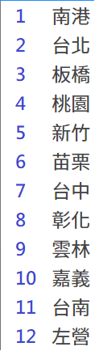

# 高鐵訂票小幫手
## forked from [BreezeWhite/THSR-Ticket](https://github.com/BreezeWhite/THSR-Ticket)

**!!--純研究用途，請勿用於不當用途--!!**

## 前置作業

安裝 Python packages 
```
pip install -r requirements.txt
```

## 執行

```bash
python thsr_ticket/main.py
```

### 修改參數

成功訂票後會建立紀錄 `/thsr_ticket/.db/history.json ` 如果下次訂票想要快速開始可以進去修改參數
```json
{
    "_default": {
        "1": {
            "adult_num": "1F",
            "dest_station": 12,
            "outbound_date": "2025-01-24",
            "outbound_delay_time": "21",
            "outbound_time": "700P",
            "personal_id": "E123456789",
            "phone": "0999999999",
            "start_station": 5
        }
        }
    
}
```

- adult_num: 預定票數，只支援成人票，只需修改數字並不要動F
- dest_station: 目標車站，數字表參考[圖一](#圖一)
- outbound_date: 出發日期
- outbound_delay_time: 可接受最晚時間的票e.g. 例子為不會搶到21點以後的票
- outbound_time: 出發時間P為下午，A為上午
- personal_id: 身分證字號
- phone: 電話 optional
- start_station: 起始車站，數字表參考[圖一](#圖一)


#### 圖一


